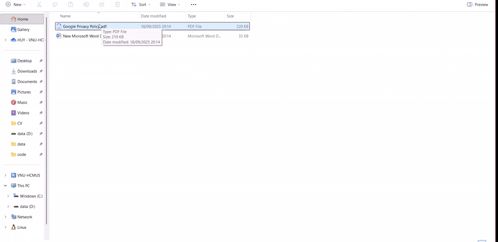

# Vietnamese AI Checker for Data Privacy

## Project Goal

Build a simple application where you can:

*   **Upload a document:** For example, a company's "Privacy Policy".
*   **Ask questions related to that document:** For example, "Does this policy mention obtaining user consent before processing sensitive data? Which article in Decree 13 regulates this?"
*   **Receive intelligent answers:** The system will use its knowledge from Decree 13 to analyze the document and answer your question, citing the relevant articles.

## How does the RAG architecture work in this project?

*   **"Knowledge Base":** The entire text of Decree 13/2023/NĐ-CP.
*   **Retrieval:** When you ask a question, the system searches the "knowledge base" to find the most relevant articles and regulations in Decree 13.
*   **Augmentation:** The system takes the retrieved articles + the document you uploaded + your question, and "packages" them all into a context-rich prompt.
*   **Generation:** This package of information is sent to a Large Language Model (LLM). The LLM will generate the final answer based on the provided context.

## How to Run

1.  **Clone the repository:**
    ```bash
    git clone https://github.com/huytrao/AI-Compliance-Assistant-for-VN-Decree-13.git
    cd AI-Compliance-Assistant-for-VN-Decree-13
    ```

2.  **Create and activate a virtual environment:**
    ```bash
    # For Windows
    python -m venv .venv
    .venv\Scripts\activate

    # For macOS/Linux
    python3 -m venv .venv
    source .venv/bin/activate
    ```

3.  **Install the required dependencies:**
    ```bash
    pip install -r requirements.txt
    ```

4.  **Run the Streamlit application:**
    ```bash
    streamlit run app.py
    ```

5.  **Use the application:**
    *   Open your web browser and navigate to the local URL provided by Streamlit.
    *   Enter your Gemini API Key in the sidebar. You can get one from [Google AI Studio](https://aistudio.google.com/app/apikey).
    *   Upload a privacy policy document to begin the analysis.
